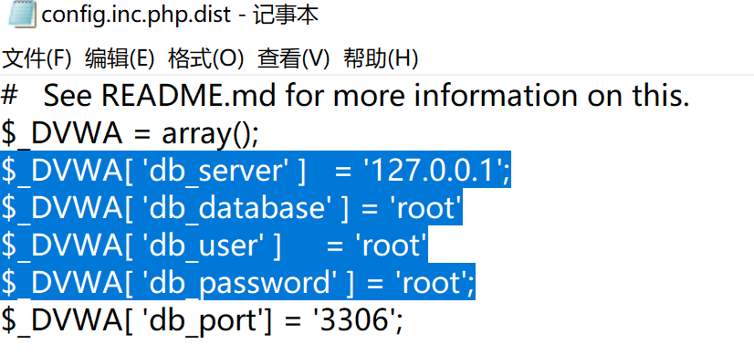

## 简介

DVWA（Damn Vulnerable Web App）是一个基于PHP/MySql搭建的Web应用程序，旨在为安全专业人员测试自己的专业技能和工具提供合法的 环境，帮助Web开发者更好的理解Web应用安全防范的过程。

DVWA一共包含十个模块分别是：

1.Bruce Force //暴力破解

2.Command Injection //命令注入

3.CSRF //跨站请求伪造

4.File Inclusion //文件包含

5.File Upload //文件上传漏洞

6.Insecure CAPTCHA //不安全的验证

7.SQL Injection //sql注入

8.SQL Injection（Blind） //sql注入（盲注）

9.XSS（Reflected） //反射型XSS

10.XSS（Stored） //存储型XSS

同时每个模块的代码都有4种安全等级：Low、Medium、High、Impossible。通过从低难度到高难度的测试并参考代码变化可帮助学习者更快的理解漏洞的原理。

DVWA是由PHP代码开发的，所以需要先搭建PHP运行环境。这里我们将采用PhpStudy来进行搭建环境，其集成了最新的Apache和PHP等程序，同时自带了phpMyadmin的管理工具和MySQL数据库，非常方便。

[phpStudy官方下载地址](https://www.xp.cn/download.html)

[DVWA下载地址](https://github.com/digininja/DVWA/archive/master.zip)

解压phpstudy后直接运行安装，注意这里的安装路径不能有中文。

将解压的DVWA-master文件夹放到phpstudy的www目录中，这里要把DVWA-master取消只读，否者会打不开网页。

修改一下config文件夹下的配置， 并把config.inc.php.dist文件名修改为config.inc.php：

等下创建数据库要用到配置里面的这个用户和密码。

接下来访问http://127.0.0.1/DVWA-master/setup.php。

这里会报错连接不到数据库，这里先启动数据库，在phpstudy软件管理中安装SQL Front工具，打开创建配置文件中定义好的数据库。

然后点击网站下方的Create/Reset Database按钮。

DVWA就会跳转到登录页面。

[//]:#(设置表格整体居中显示)

