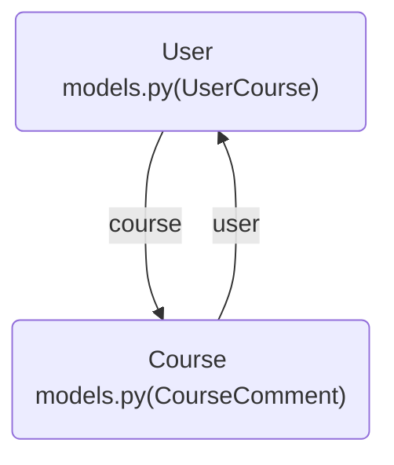
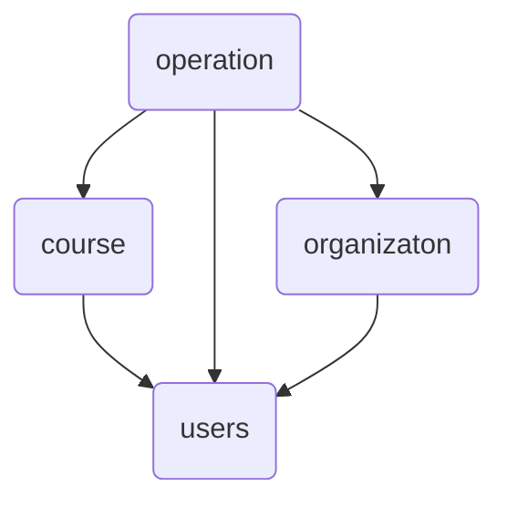

#  目标

使用`Django`和`xadmin`开发一个在线教育网站。

# 数据库设计

- `django app`设计

  主要有四个模块，用户、课程、授课机构（讲师）、用户操作信息。

- `user models.py`编写

- `couser models.py`编写

- `organization models.py`编写

- `operation models.py`编写

## 创建项目

```python
django-admin startproject mxonline
```

## 创建应用

```shel
python manage.py startapp courses

python manage.py startapp users

python manage.py startapp operations

python manage.py startapp organizations
```

新建一个`apps`包，把上面创建的四个应用放到这个文件夹下面，这样项目的结构就更加清晰。这样需要在`seeting``中设置如下配置，把`apps`添加到系统路径路面去。

```python
import sys
import os

sys.path.insert(0, os.path.join(BASE_DIR, 'apps'))
```

将这四个应用配置到`INSTALLED_APPS`中。

```python
INSTALLED_APPS = [
    'django.contrib.admin',
    'django.contrib.auth',
    'django.contrib.contenttypes',
    'django.contrib.sessions',
    'django.contrib.messages',
    'django.contrib.staticfiles',
    'apps.courses.apps.CourseConfig',
    'apps.users.apps.UsersConfig',
    'apps.operations.apps.OperationsConfig',
    'apps.organizations.apps.OrganizationsConfig',
]
```

安装`mysqlclient`模块，这个才能建立数据库模型。

```shel
pip install mysqlclient
```

 可以尝试运行，`python manage.py runserver`，没有报错说明以上配置都是正确的。


## 设计`Users.models`用户表

在`user.mogels.py`创建用户表覆盖默认的用户表。

```python
from datetime import datetime
from django.db import models
from django.contrib.auth.models import AbstractUser


# model的继承机制
class BaseModel(models.Model):
    add_time = models.DateTimeField(default=datetime.now, verbose_name="添加时间")

    # 防止生成独立的表
    class Meta:
        abstract = True


GENDER_CHOICES = {
    ("male", "男"),
    ("female", "女")
}


# 定义用户表
class UserProfile(AbstractUser):
    """昵称，生日，性别，地址，手机号，用户图像"""
    nick_name = models.CharField(max_length=50, verbose_name="昵称", default="")
    birthday = models.DateField(verbose_name="生日", null=True, blank=True)
    gender = models.CharField(verbose_name="性别", choices=GENDER_CHOICES, max_length=6)
    address = models.CharField(max_length=100, verbose_name="地址", default="")
    mobile = models.CharField(max_length=11, verbose_name="手机号码", unique=True)
    image = models.ImageField(upload_to="head_image/%Y/%m", default="head_image/uploaded.jpg", verbose_name="头像")

    class Meta:
        verbose_name = "用户信息"
        verbose_name_plural = verbose_name

    def __str__(self):
        if self.nick_name:
            return self.nick_name
        else:
            return self.username
```

注意，要在`seetings`中修改默认的`user`模块,，添加下面的代码。

```python
AUTH_USER_MODEL = "users.UserProfile"
```

然后再生成数据库，首先运行`pip install Pillow`安装`Pillow`模块提供对头像的支持。

```python
python manage.py makemigrations
python manage.py migrate
```

用`Navicat`查看数据库，就可以看到所有的用户信息创建到`user_userprofile`的表中了。


## Model设计中要注意的问题

### 循环引用



为什么要设计`operations`这个`model`？避免循环引用的情况发生。

### 分层设计



上层可以引用下层，下层不能引用上层。

## 设计`Courses.models`课程信息表

- `Course`-课程的基本信息
- `Lesson`-章节信息
- `Video`-视频
- `CourseResource`-课程资源

```pytho
from django.db import models
from users.models import BaseModel


class Course(BaseModel):
    """定义课程信息"""
    name = models.CharField(verbose_name="课程名", max_length=50)
    desc = models.CharField(verbose_name="课程描述", max_length=300)
    learn_times = models.IntegerField(default=0, verbose_name="学习时长（分钟数）")
    degree = models.CharField(verbose_name="难度", choices=(("cj", "初级"), ("zj", "中级"), ("gj", "高级")), max_length=2)
    students = models.IntegerField(default=0, verbose_name="学习人数")
    fav_nums = models.IntegerField(default=0, verbose_name="收藏人数")
    click_nums = models.IntegerField(default=0, verbose_name="点击数")
    category = models.CharField(default="后端开发", max_length=120, verbose_name="课程类别")
    tag = models.CharField(default="", verbose_name="课程标签", max_length=10)
    youneed_know = models.CharField(default="", max_length=300, verbose_name="课程须知")
    teacher_tell = models.CharField(default="", max_length=300, verbose_name="老师告诉你")
    details = models.TextField(verbose_name="课程详情")
    image = models.ImageField(upload_to="corse/%Y/%m", verbose_name="封面图", max_length=100)

    class Meta:
        verbose_name = "课程信息"
        verbose_name_plural = verbose_name


class Lesson(BaseModel):
    """定义章节信息"""
    course = models.ForeignKey(Course, on_delete=models.CASCADE)  # on_delete表示对应的外键数据被删除，当前的数据也删除
    name = models.CharField(max_length=100, verbose_name="章节名称")
    learn_times = models.IntegerField(default=0, verbose_name="学习时长（分钟数）")

    class Meta:
        verbose_name = "课程章节"
        verbose_name_plural = verbose_name


class Video(BaseModel):
    """章节中的视频信息"""
    lessons = models.ForeignKey(Lesson, verbose_name="章节", on_delete=models.CASCADE)
    name = models.CharField(max_length=100, verbose_name="视频名")
    learn_times = models.IntegerField(default=0, verbose_name="学习时长（分钟数）")
    url = models.CharField(max_length=200, verbose_name="访问地址")

    class Meta:
        verbose_name = "视频"
        verbose_name_plural = verbose_name


class CourseResource(BaseModel):
    """定义课程资源"""
    course = models.ForeignKey(Course, on_delete=models.CASCADE, verbose_name="课程")
    name = models.CharField(max_length=100, verbose_name="名称")
    file = models.FileField(upload_to="course/resource/%Y/%m", verbose_name="下载地址", max_length=200)

    class Meta:
        verbose_name = "课程资源"
        verbose_name_plural = verbose_name
```

## 设计`organizations.models`授课机构

```python
from django.db import models
from users.models import BaseModel


class City(BaseModel):
    """定义城市信息"""
    name = models.CharField(max_length=20, verbose_name="城市")
    desc = models.CharField(max_length=200, verbose_name="描述")

    class Meta:
        verbose_name = "城市"
        verbose_name_plural = verbose_name


class CourseOrg(BaseModel):
    """定义机构信息"""
    name = models.CharField(max_length=50, verbose_name="机构名称")
    desc = models.TextField(verbose_name="描述")
    tag = models.CharField(default="全国知名", max_length=10, verbose_name="机构标签")
    category = models.CharField(default="pxjg", verbose_name="机构类别", max_length=4,
                                choices=(("pxjg", "培训机构"), ("gr", "个人"), ("gx", "高校")))
    click_nums = models.IntegerField(default=0, verbose_name="点击数")
    fav_nums = models.IntegerField(default=0, verbose_name="收藏数")
    image = models.ImageField(upload_to="org/%y/%m", verbose_name="logo", max_length=100)
    address = models.CharField(max_length=200, verbose_name="机构地址")
    students = models.IntegerField(default=0, verbose_name="学习人数")
    course_nums = models.IntegerField(default=0, verbose_name="课程数")
    city = models.ForeignKey(City, on_delete=models.CASCADE, verbose_name="所在城市")

    class Meta:
        verbose_name = "课程机构"
        verbose_name_plural = verbose_name


class Teacher(BaseModel):
    """定义讲师信息"""
    org = models.ForeignKey(CourseOrg, on_delete=models.CASCADE, verbose_name="所属机构")
    name = models.CharField(max_length=50, verbose_name="教师名")
    work_years = models.IntegerField(default=0, verbose_name="工作年限")
    work_company = models.CharField(max_length=50, verbose_name="就职公司")
    work_position = models.CharField(max_length=50, verbose_name="公司职位")
    points = models.CharField(max_length=50, verbose_name="教学特点")
    click_nums = models.IntegerField(default=0, verbose_name="点击数")
    fav_nums = models.IntegerField(default=0, verbose_name="收藏数")
    age = models.IntegerField(default=18, verbose_name="年龄")
    image = models.ImageField(default='', upload_to="teacher/%Y/%m", verbose_name="头像", max_length=100)


    class Meta:
        verbose_name = "讲师"
        verbose_name_plural = verbose_name
```

相应的，`Courses.models`添加`teacher`的外键。

```python
teacher = models.ForeignKey(Teacher, on_delete=models.CASCADE, verbose_name="讲师")
```

## 设计`operations.models`用户操作

```python
from django.db import models
from django.contrib.auth import get_user_model
from users.models import BaseModel
from courses.models import Course

# 获取User
User = get_user_model()


class UserAsk(BaseModel):
    """用户咨询信息"""
    name = models.CharField(max_length=20, verbose_name="姓名")
    mobile = models.CharField(max_length=11, verbose_name="手机")
    course_name = models.CharField(max_length=50, verbose_name="课程名")

    class Meta:
        verbose_name = "用户咨询"
        verbose_name_plural = verbose_name


class CourseComments(BaseModel):
    """用户评论信息"""
    user = models.ForeignKey(User, on_delete=models.CASCADE, verbose_name="用户")
    course = models.ForeignKey(Course, on_delete=models.CASCADE, verbose_name="课程")
    comments = models.CharField(max_length=200, verbose_name="评论内容")

    class Meta:
        verbose_name = "课程评论"
        verbose_name_plural = verbose_name


class UserFavorite(BaseModel):
    """用户收藏信息"""
    user = models.ForeignKey(User, on_delete=models.CASCADE, verbose_name="用户")
    course = models.ForeignKey(Course, on_delete=models.CASCADE, verbose_name="课程")
    fav_id = models.IntegerField(verbose_name="数据ID")
    fav_type = models.IntegerField(choices=((1, "课程"), (2, "课程机构"), (3, "讲师")), default=1, verbose_name="收藏")

    class Meta:
        verbose_name = "用户收藏"
        verbose_name_plural = verbose_name


class UserMessage(BaseModel):
    """用户消息信息"""
    user = models.ForeignKey(User, on_delete=models.CASCADE, verbose_name="用户")
    message = models.CharField(max_length=200, verbose_name="用户消息")
    has_read = models.BooleanField(default=False, verbose_name="是否已读")

    class Meta:
        verbose_name = "用户消息"
        verbose_name_plural = verbose_name


class UserCourses(BaseModel):
    """用户课程信息"""
    user = models.ForeignKey(User, on_delete=models.CASCADE, verbose_name="用户")
    course = models.ForeignKey(Course, on_delete=models.CASCADE, verbose_name="课程")

    class Meta:
        verbose_name = "用户课程"
        verbose_name_plural = verbose_name
```

以上，这四个`model`大致设计完成，后面根据需要进行优化。

接下来重新`makegrations`和`migrate`一下生成数据库表结构。

```python
python manage.py makemigrations
python manage.py migrate
```

# 使用`xadmin`快速搭建后台管理系统

- 权限管理
- 少前端样式
- 快速开发

## 创建管理用户

```python
>>> python manage.py createsuperuser
Username: Holy
Email address: espholychan@outlook.com
Password:
Password (again):
The password is too similar to the username.
This password is too short. It must contain at least 8 characters.
Bypass password validation and create user anyway? [y/N]: y
Superuser created successfully.
```

可以看到这个用户添加到`user_userprofile`表中。


`is_staff`带表用户是否能登录管理系统，这个值为1代表用户有权限登录。


输入用户名密码之后进入后台系统，可以看到目前是英文界面。


将`seeting.py`中下面三个参数修改，这样就可以显示为中文。

```python
LANGUAGE_CODE = 'zh-hans'

TIME_ZONE = 'Asia/Shanghai'

USE_TZ = False
```


### 注册模型到`admin`

在`users.models.py`中加入下面的代码。

```python
from django.contrib import admin
from .models import UserProfile


# Register your models here.
class UserProfileAdmin(admin.ModelAdmin):
    pass


admin.site.register(UserProfile, UserProfileAdmin)
```

然后刷新浏览器，可以看到`USERS`用户信息就添加进去了。


这里的`User`代表我们创建的`app`的名称，如果要修改成中文，可以在`users.apps.py`中添加`verbose_name="用户"`。

```python
from django.apps import AppConfig


class UsersConfig(AppConfig):
    default_auto_field = 'django.db.models.BigAutoField'
    name = 'users'
    verbose_name = "用户"
```

## 使用`xadmin`替代`Django-admin`

#### 安装

```python
pip install https://codeload.github.com/sshwsfc/xadmin/zip/django2
```

如果报错 `Using legacy setup.py install for xadmin, since package 'wheel' is not installed.` 只需要 `pip install wheel`。

使用源码安装，在`apps`同级目录新建`extra_apps`文件夹，将获取的`xadmin`包放进去。

在配置文件中导入包：

```python
sys.path.insert(1, os.path.join(BASE_DIR, 'extra_apps'))
```

在配置文件中注册如下应用：

```python
INSTALLED_APPS = [
    ...
    'xadmin',
    'crispy_forms',
    'reversion',
    ...
]
```

`xadmin`有建立自己的数据库模型类，需要进行数据库迁移

```shell
python manage.py makemigrations
python manage.py migrate
```

在总路由中添加`xadmin`的路由信息

```python
import xadmin
xadmin.autodiscover()

# version模块自动注册需要版本控制的 Model
from xadmin.plugins import xversion
xversion.register_models()

urlpatterns = [
    path(r'xadmin/', xadmin.site.urls),
]
```

经过一番折腾，配置好了，详细的过程没法记录。主要是依靠百度。重新换了个数据库，又将`Django`降级为2.2版本，之前默认是最新的3.2版本，有很多兼容性问题。接着往下走。


### `adminx`注册

在`courses`下面新建一个`adminx.py`的文件，添加下面的代码：

```python
from extra_apps import xadmin

from .models import Course


class CourseAdmin(object):
    pass


xadmin.site.register(Course, CourseAdmin)
```

访问`xadmin`管理界面。


在`organizations`下面新建一个`adminx.py`的文件，添加下面的代码：

```python
from extra_apps import xadmin

from .models import Teacher, CourseOrg, City


class CityAdmin(object):
    # 显示的model里面的字段，要和里面的一致
    list_display = ["id", "name", "desc", "add_time"]
    # 搜索字段设置
    search_fields = ["name", "desc"]
    # 过滤字段设置
    list_filter = ["name", "desc", "add_time"]
    # 可编辑
    list_editable = ["name", "desc"]


class CourseOrgAdmin(object):
    pass


class TeacherAdmin(object):
    pass


xadmin.site.register(City, CityAdmin)
xadmin.site.register(CourseOrg, CourseOrgAdmin)
xadmin.site.register(Teacher, TeacherAdmin)
```

重载后的效果：


## 注册所有的`models`

### `courses.adminx.py`

```python
from extra_apps import xadmin

from .models import Course, Lesson, Video, CourseResource


class CourseAdmin(object):
    list_display = ["name", "desc", "details", "degree", "learn_times", "students", "teacher"]
    search_fields = ["name", "desc", "details", "learn_times", "students", "teacher"]
    list_filter = ["degree"]
    list_editable = ["desc", "degree"]


class LessonAdmin(object):
    list_display = ["name", "course", "learn_times"]
    search_fields = ["name", "course"]
    list_editable = ["name", "learn_times"]


class VideoAdmin(object):
    list_display = ["lessons", "name", "learn_times", "url"]
    search_fields = ["lessons", "name"]
    list_editable = ["lessons", "url"]


class CourseResourceAdmin(object):
    list_display = ["course", "name", "file"]
    search_fields = ["course", "name"]
    list_editable = ["course", "file"]


xadmin.site.register(Course, CourseAdmin)
xadmin.site.register(Lesson, LessonAdmin)
xadmin.site.register(Video, VideoAdmin)
xadmin.site.register(CourseResource, CourseResourceAdmin)
```

### `oragnizations.adminx.py`

```python
from extra_apps import xadmin

from .models import Teacher, CourseOrg, City


class CityAdmin(object):
    # 显示的model里面的字段，要和里面的一致
    list_display = ["id", "name", "desc", "add_time"]
    # 搜索字段设置
    search_fields = ["name", "desc"]
    # 过滤字段设置
    list_filter = ["name", "desc", "add_time"]
    # 可编辑
    list_editable = ["name", "desc"]


class CourseOrgAdmin(object):
    list_display = ["name", "desc", "click_nums", "fav_nums"]
    search_fields = ["name", "desc", "click_nums", "fav_nums"]
    list_filter = ["name", "desc", "click_nums", "fav_nums"]


class TeacherAdmin(object):
    list_display = ["org", "name", "work_years", "work_company"]
    search_fields = ["org", "name", "work_years", "work_company"]
    list_filter = ["org", "name", "work_years", "work_company"]


xadmin.site.register(City, CityAdmin)
xadmin.site.register(CourseOrg, CourseOrgAdmin)
xadmin.site.register(Teacher, TeacherAdmin)
```

###  `operations.adminx.py`

```python
from extra_apps import xadmin

from .models import UserAsk, CourseComments, UserFavorite, UserMessage, UserCourses


class UserAskAdmin(object):
    list_display = ["name", "mobile", "course_name", "add_time"]
    search_fields = ["name", "mobile", "course_name"]
    list_filter = ["name", "mobile", "course_name", "add_time"]


class CourseCommentsAdmin(object):
    list_display = ["user", "course", "comments", "add_time"]
    search_fields = ["user", "course", "comments"]
    list_filter = ["user", "course", "comments", "add_time"]


class UserFavoriteAdmin(object):
    list_display = ["user", "course", "fav_id", "fav_type"]
    search_fields = ["user", "course", "fav_id", "fav_type"]
    list_filter = ["user", "course", "fav_id", "fav_type"]


class UserMessageAdmin(object):
    list_display = ["user", "message", "has_read", "add_time"]
    search_fields = ["user", "message", "has_read", "add_time"]
    list_filter = ["user", "message", "has_read", "add_time"]


class UserCoursesAdmin(object):
    list_display = ["user", "course", "add_time"]
    search_fields = ["user", "course"]
    list_filter = ["user", "course", "add_time"]


xadmin.site.register(UserAsk, UserAskAdmin)
xadmin.site.register(CourseComments, CourseCommentsAdmin)
xadmin.site.register(UserFavorite, UserFavoriteAdmin)
xadmin.site.register(UserMessage, UserMessageAdmin)
xadmin.site.register(UserCourses, UserCoursesAdmin
```

## `xadmin`的全局配置

```python
# 定义全局参数
class GlobalSettings(object):
    site_title = "向日葵后台管理系统"
    site_footer = "向日葵学习网"
    menu_style = "accordion"


class BaseSettings(object):
    enable_themes = True
    use_booswatch = True
    
xadmin.site.register(xadmin.views.CommAdminView, GlobalSettings)
xadmin.site.register(xadmin.views.BaseAdminView, BaseSettings)
```

上面的代码设置了管理系统的名称和页脚的名称，激活主体更换功能，可以自定义主体样式。

### 对于外键的过滤

```python
class CourseAdmin(object):
    list_display = ["name", "desc", "details", "degree", "learn_times", "students", "teacher"]
    search_fields = ["name", "desc", "details", "learn_times", "students", "teacher"]
    # 对于外键的过滤，使用双下划线
    list_filter = ["degree", "teacher__name"]
    list_editable = ["desc", "degree"]
```

对于外键的过滤，使用双下划线。


# 登录注册的实现

- 静态文件设置

`seetings.py`中的配置。

```
STATIC_URL = '/static/'

# 添加静态文件
STATICFILES_DIRS = [
    os.path.join(BASE_DIR, "static"),
]
```


## 首页的配置

## 首页的配置

`urls.py`中添加路由。

```python
path('', TemplateView.as_view(template_name="index.html")),
```

`templates/index.html`

```html

<div class="personal">
    <dl class="user fr">
        <dd>bobby</dd>
        <dt></dt>
    </dl>
    <div class="userdetail">
        <dl>
            <dt>
            </dt>
            <dd>
                <h2>django</h2>
                <p>bobby</p>
            </dd>
        </dl>
        <div class="btn">
            <a class="personcenter fl" href="usercenter-info.html">进入个人中心</a>
            <a class="fr" href="/logout/">退出</a>
        </div>
    </div>
</div>


    <a style="color:white" class="fr registerbtn" href="register">注册</a>
    <a style="color:white" class="fr loginbtn" href="">登录</a>


```

`request.user.is_authenticated`判断用户是否登录。

## 登录逻辑

### 表单验证

设计一个`form`，在`users`文件夹下新建一个`forms.py`文件。

```python
from django import forms


class LoginForm(forms.Form):
    username = forms.CharField(required=True, max_length=20, min_length=2)
    password = forms.CharField(required=True, max_length=20, min_length=3)
```
`user.views.py`
```python
from django.shortcuts import render
from django.views import View
# 验证用户方法
from django.contrib.auth import authenticate, login
from django.http import HttpResponseRedirect
from django.urls import reverse
from apps.users.forms import LoginForm


# Create your views here.
class LoginView(View):
    def get(self, request, *args, **kwargs):
        return render(request, "login.html")

    def post(self, request, *args, **kwargs):
        login_form = LoginForm(request.POST)
        # user_name = request.POST.get('username', '')
        # password = request.POST.get('password', '')

        # 表单验证
        if login_form.is_valid():
            # 用户通过用户名和密码查询用户是否存在
            user = authenticate(username=login_form.cleaned_data["username"],
                                password=login_form.cleaned_data["password"])
            if user is not None:
                # 查询到用户
                login(request, user)
                # 登录成功之后怎么返回页面
                return HttpResponseRedirect(reverse("index"))
            else:
                # 未查询到用户
                return render(request, "login.html", {"msg": "用户名或密码错误", "login_form": login_form})
        else:
            return render(request, "login.html", {"login_form": login_form})
```

`login.html`

```html
<form class="tab-form" action="" method="post" autocomplete="off" id="form1">
    <div class="form-group marb20 errorput">
        <input name="username" id="account_l" value="{{ login_form.username.value }}" type="text" placeholder="手机号/邮箱"/>
    </div>
    <div class="form-group marb8 errorput">
        <input name="password" id="password_l" value="{{ login_form.password.value }}" type="password" placeholder="请输入您的密码"/>
    </div>
    <div class="error btns login-form-tips" id="jsLoginTips">
        
                
                    {{ error }}
                
            
                {{ msg }}
        
    </div>
    <div class="auto-box marb38">
        <a class="fr" href="forgetpwd">忘记密码？</a>
    </div>
    <input class="btn btn-green" id="jsLoginBtn" type="submit" value="立即登录 > "/>
    
</form>
```

### 退出登录

```python
class LogoutiVew(View):
    def get(self, request, *args, **kwargs):
        logout(request)
        return HttpResponseRedirect(reverse('index'))
```

### 动态验证码登录

云片网审核不通过不支持


[//]:#(设置表格整体居中显示)
<style>
    table
    {
        margin: auto;
        font-size: 80%;
    }
</style>


