## 概述

- 什么是Mermaid？

  `Mermaid`是一种基于`Javascript`的绘图工具，使用类似于`Markdown`的语法，可以方便快捷使用代码创建简洁美观的图表。
  项目地址：[https://github.com/mermaid-js/mermaid](https://github.com/mermaid-js/mermaid)

- 如何使用Mermaid？

  使用特定的 `Mermaid` 渲染器；
  使用集成了 `Mermaid` 渲染功能的 `Markdown` 编辑器，比如`Typora`。使用时，需要将代码块的语言选择为`Mermaid`。


- Mermaid能绘制哪些图？

  饼状图：使用 `pie` 关键字
  流程图：使用 `graph` 关键字
  序列图：使用 `sequenceDiagram` 关键字
  甘特图：使用 `gantt` 关键字
  类图：使用 `classDiagram` 关键字
  状态图：使用 `stateDiagram` 关键字
  用户旅程图：使用 `journey` 关键字

`%%` 注释。

## 流程图

### 方向

- TB/TD - top bottom
- BT - bottom top
- RL - right left
- LR - left right 

从上到下：

```shell
graph TB
    起点 --> 终点
```

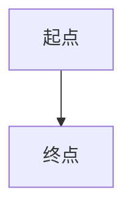

从下到上：

```shell
grpah BT
    起点 --> 终点
```

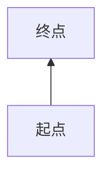

从左到右：

```shell
grpah LR
    起点 --> 终点
```


从右到左：

```shell
grpah RL
    起点 --> 终点
```


### 节点

默认节点是矩形。

```shell
grpah LR
    id
```

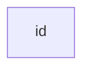

带文字节点：

```shell
grpah LR
    id[带文字节点]
```

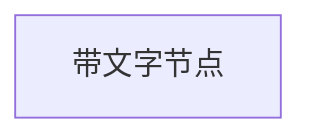

圆角节点：

```shell
grpah LR
    id(圆角节点)
```


圆形节点：

```shell
grpah LR
    id((圆形节点))
```

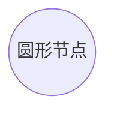

不对称节点：

```shell
graph LR
    id>不对称节点]
```


菱形节点：

```shell
graph LR
    id{菱形节点}
```

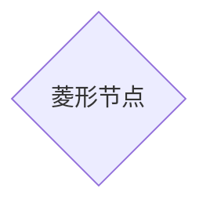

### 连接线

实线、箭头、无文字：

```shell
graph LR
    A-->B
```


实线，无箭头，无文字：

```shell
graph LR
    A---B
```

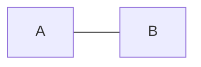

实线，无箭头，文字：
前面两个 `-`，后面三个 `-`。

```shell
graph LR
    A-- 文字 ---B
```

或

```shell
graph LR
    A--- |文字| B
```

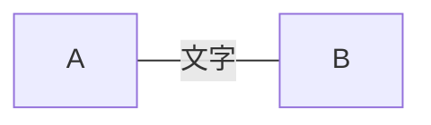

实线，箭头，文字：

```shell
graph LR
    A-- 文字 -->B
```

或

```shell
graph LR
    A--> |文字| B
```

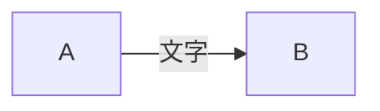

虚线，箭头，无文字:

```shell
graph LR
    A-.->B
```

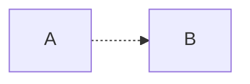

虚线，无箭头，无文字:

```shell
graph LR
    A-.-B
```

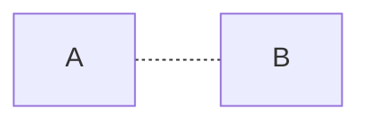

虚线，箭头，文字:

```shell
graph LR
    A-. text .->B
```

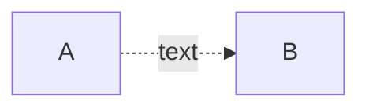

大箭头，无文字：

```shell
graph LR
    A==>B
```

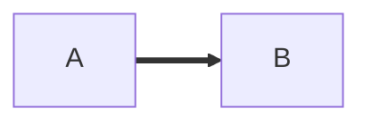

大箭头，文字：

```shell
graph LR
    A==text==>B
```

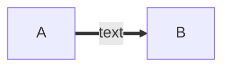

### 特殊语法

- 引号

文字里用引号避免一些特殊字符的错误。比如矩形节点里有 `()` 时就无法渲染，所以加上引号。

```shell
graph LR
    A["This is the (text) in the box"]
```


- 实体字符

可以使用 `HTML` 中的实体字符。

```shell
graph LR
    A["A double quote:#quot;"]-->B[]
```

```mermaid
graph LR
    A["A dec char:#9829"]
```

### 子图

```shell
graph TB
  c1 --> a2
  subgraph one
  a1 --> a2
  end
  subgraph one
  b1 --> b2
  end
  subgraph one
  c1 --> c2
  end
```

```mermaid
graph TB
  c1 --> a2
  subgraph one
  a1 --> a2
  end
  subgraph one
  b1 --> b2
  end
  subgraph one
  c1 --> c2
  end
```

### 样式

`linkStyle` 后面的数字表示第几根线，从 `0` 开始。可以指定颜色和粗细。

```shell
graph TB
  A-->B
  A-->c
  B-->D
  c-->D
  linkStyle 0 stroke:#0ff, stroke-width:2px;
  linkStyle 1 stroke:#f0f, stroke-width:3px;
  linkStyle 2 stroke:#ff9, stroke-width:4px;
  linkStyle 3 stroke:#ff5, stroke-width:5px;
```

```mermaid
graph TB
  A-->B
  A-->c
  B-->D
  c-->D
  linkStyle 0 stroke:#0ff, stroke-width:2px;
  linkStyle 1 stroke:#f0f, stroke-width:3px;
  linkStyle 2 stroke:#ff9, stroke-width:4px;
  linkStyle 3 stroke:#ff5, stroke-width:5px;
```

可以设置节点背景，边框颜色，粗细，实线还是虚线

```shell
graph LR
    id1(起点)-->id2(终点)
    style id1 fill:#f9f,stroke:#333,stroke-width:4px
    style id2 fill:#ff3,stroke:#f77,stroke-width:2px,stroke-dasharray:5, 4
```

```mermaid
graph LR
    id1(起点)-->id2(终点)
    style id1 fill:#f9f,stroke:#333,stroke-width:4px
    style id2 fill:#ff3,stroke:#f77,stroke-width:2px,stroke-dasharray:5, 4
```

### 样式类

```shell
graph LR
  A--B

  %% 定义样式类
  classDef classname fill:#f9f,stroke:#333,stroke-width:4px;

  %% 应用样式表，markdown里没效果
  class A className
```

```mermaid
graph LR
  A---B

  %% 定义样式类
  classDef classname fill:#f9f,stroke:#333,stroke-width:4px;

  %% 应用样式表，markdown里没效果
  class A className
```

```shell
classDef default fill:#f9f,stroke:#333,stroke-width:4px;
```

定义一个名为 `default` 的类，节点没有指定特定样式类时，将都会应用这个样式类。

## 序列图

### 定义角色

```shell
participant 甲
participant 乙
```

其中 `participant` 表示定义参与者， `甲` 和 `乙` 是就是角色名，可以是字符串，不含空格。可以使用`as`关键字给角色取个别名。

```shell
participant 嬴政 as 秦始皇
```

```mermaid
sequenceDiagram
  participant 甲
  participant 乙
  participant 嬴政 as 秦始皇
```

注意：

- 参与者按照出场先后顺序排列，如果要把某个角色排在前面，那么就一定要定义它。
- 预先定义的角色排列完毕之后。没有定义的统统按出场顺序跟在后面。
- 定义语句不一定要放在消息传递之前，在中间或者后面也是可以的。
- `Mermaid` 这里存在一个bug。角色名后面一定不能有空格。空格和角色名一起被视作另外一个角色

### 消息连线

通过连线代表角色消息的过程。消息连线有**虚线**和**实线**两种基本类型。

- 基本线型

基本连线就两种，虚线和实线。用`->`表示实线，用`-->`表示虚线。

- 箭头连线

在基本线型后面再加上一个`>`，用`->>`表示实线，用`-->>`表示虚线。

- 终止符

在基本线型中把`>`修改为`x`代表终止消息。

```shell
sequenceDiagram
  participant 嬴政 as 秦始皇
  participant 刘邦 as 汉高祖
  嬴政->刘邦:我大秦还在吗？（实线）
  刘邦-->嬴政:还在，不过改名字了（虚线）
  嬴政->>刘邦:为什么改名字了？（实线加个箭头）
  刘邦-->>嬴政:我觉得不好听？（虚线加个箭头）
  嬴政-x刘邦:我他么（箭头实线，加上叉）
  刘邦--x嬴政:拜拜了您嘞！（箭头虚线，加上叉）
```

```mermaid
sequenceDiagram
  participant 嬴政 as 秦始皇
  participant 刘邦 as 汉高祖
  嬴政->刘邦:我大秦还在吗？（实线）
  刘邦-->嬴政:还在，不过改名字了（虚线）
  嬴政->>刘邦:为什么改名字了？（实线加个箭头）
  刘邦-->>嬴政:我觉得不好听？（虚线加个箭头）
  嬴政-x刘邦:我他么（箭头实线，加上叉）
  刘邦--x嬴政:拜拜了您嘞！（箭头虚线，加上叉）
```

### 角色的任务期

消息连线后面加上`+/-`，表示接收消息的角色这时候应该开始或者结束自身任务处理。

如果不是上面这种情况，是需要用 `activate` 和 `deactivate` 语句来启动和结束任务的。

开始处理用语句： `activate` 角色；处理完毕用语句： `deactivate` 角色。

```shell
sequenceDiagram
  participant 甲
  participant 已
  甲-->>+已:你开始做任务1吧
  已-->>甲:收到，正在处理任务1
  甲->>已:把任务2也处理下吧
  activate 已
  已->>甲:我现在同时处理任务2
  已-x甲:任务2处理完成，结束任务2
  deactivate 已
  已->>-甲:任务1处理完成，结束任务1
```

```mermaid
sequenceDiagram
  participant 甲
  participant 已
  甲-->>+已:你开始做任务1吧
  已-->>甲:收到，正在处理任务1
  甲->>已:把任务2也处理下吧
  activate 已
  已->>甲:我现在同时处理任务2
  已-x甲:任务2处理完成，结束任务2
  deactivate 已
  已->>-甲:任务1处理完成，结束任务1
```

### 角色备注

给角色贴上备注 `note` ，可以使其被更好地理解。备注的位置有角色的左边、右边或者上方，记住没有下方。

```shell
Note left of|right of|over John,Alice: Text in note
```

上面的语法很好理解， `Note` 是固定词汇，`left of|right of|over`是备注的位置，左、右或中，`John,Alice`是被贴备注的角色，最后面的是备注内容。注意其中`over`不带`of`；且可以同时为多个角色贴备注。

```shell
sequenceDiagram
  participant 甲
  participant 已
  participant 丙
  Note over 甲,已:这是甲乙的备注
  Note over 甲:这是甲的备注
  Note over 已,丙:这是乙丙的备注
  Note over 已:这是乙的备注
  Note over 甲,丙:这是甲丙的备注
  Note over 丙:这是丙的备注
  Note left of 甲:这是甲备注左边Note left of 甲
  Note right of 丙:这是丙备注右边Note right of 丙
```

```mermaid
sequenceDiagram
  participant 甲
  participant 已
  participant 丙
  Note over 甲,已:这是甲乙的备注
  Note over 甲:这是甲的备注
  Note over 已,丙:这是乙丙的备注
  Note over 已:这是乙的备注
  Note over 甲,丙:这是甲丙的备注
  Note over 丙:这是丙的备注
  Note left of 甲:这是甲备注左边Note left of 甲
  Note right of 丙:这是丙备注右边Note right of 丙
```

### 选择时序

时序在处理的时候，肯定会遇上有条件执行的情况，它的语法如下

```shell
alt 可选语句说明
...
else
...
end
```

其中的 `alt` 是 `alternative` 的缩写，即这有两组时序是二选一的，相当于`if-else`语句。

如果没有`else`，那么用另外一个关键词`opt`，他是`optional`的缩写。

```shell
opt 条件说明
end
```

```shell
sequenceDiagram
  participant A
  participant B
  A->>B: 你好吗？
  alt 如果B很好
    B-->>A: 我很好
  else 如果B不好
    B-->>A: 我不好
  end
  A->>B: 有空吗？打酱油去
  opt B没空，酱油还是得打
    B-->>A: 去吧
  end
```

```mermaid
sequenceDiagram
  participant A
  participant B
  A->>B: 你好吗？
  alt 如果B很好
    B-->>A: 我很好
  else 如果B不好
    B-->>A: 我不好
  end
  A->>B: 有空吗？打酱油去
  opt B没空，酱油还是得打
    B-->>A: 去吧
  end
```

### 循环时序

把几个语句用`loop end`语句圈起来，这就是时序循环。语法如下

```shell
loop 循环语句说明
...语句
end
```

```shell
sequenceDiagram
  participant A
  participant B
  A->>B:有人吗？
  B->>A:没人
  loop 话痨
    B->>A:不要应答
  end
  A-->>B:三体看多了...
```

```mermaid
sequenceDiagram
  participant A
  participant B
  A->>B:有人吗？
  B->>A:没人
  loop 话痨
    B->>A:不要应答
  end
  A-->>B:三体看多了...
```