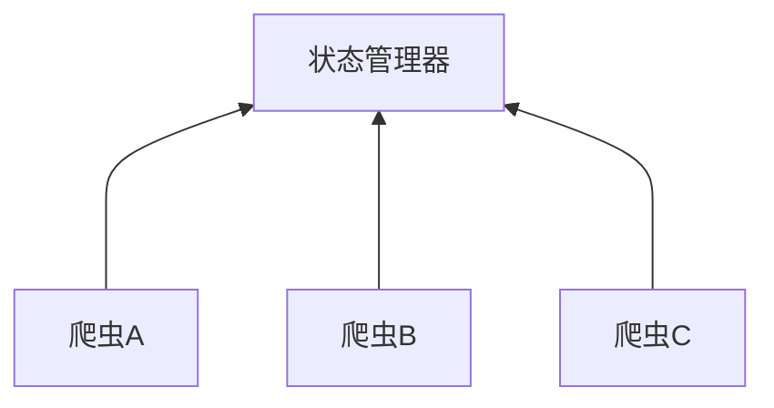

## 分布式爬虫要点



通过状态管理器集中管理爬虫。

分布式爬虫的优点：

1. 充分利用多机器的宽带加速爬取
2. 充分利用多机器的`IP`加速爬取速度

### 分布式要解决的问题

request队列集中管理

去重集中管理

## `Redis`

`Redis（Remote Dictionary Server )`，即远程字典服务，是一个开源的使用`ANSI C`语言编写、支持网络、可基于内存亦可持久化的日志型、`Key-Value`数据库，并提供多种语言的`API`。

官网`redis.io`。

#### 安装

Windows版本`msi`[下载地址](https://github.com/microsoftarchive/redis/releases)


设置最大为100M。


找到安装目录（C:\Program Files\Redis）下的redis.windows-service.conf文件，使用VScode或Notepad++打开，找到requirepass，这个是用于设置redis访问密码。这个文件需要管理员权限才能修改，一定要使用管理员权限打开。


在服务中查看Redis是否开启，如果没有开启手动开启。这里修改了配置文件后需要重启该服务。


运行安装目录下的redis-cli.exe文件就可以进入redis命令控制行。


### `Redis`数据类型

#### 字符串

设置变量

```redis
set 变量名  "变量值"
```

获取变量

```redis
get 变量名
```

比如设置一个名为name的变量。

```shell
127.0.0.1:6379> set name "holy"
OK
127.0.0.1:6379> get name
"holy"
```

获取字符变量切片

```redis
getrange 变量名 num1 num2
```

比如：

```shell
127.0.0.1:6379> getrange name 2 3
"ly"
```

获取字符串长度

```redis
strlen 变量名
```

比如：

```shell
127.0.0.1:6379> strlen name
(integer) 4
```

增加字符

```redis
append 变量名 "字符串值"
```

比如：

```shell
127.0.0.1:6379> append name "chan"
(integer) 8
127.0.0.1:6379> get name
"holychan"
```

#### 散列/哈希

#### 列表

#### 集合

#### 可排序集合


[//]:#(设置表格整体居中显示)
<style>
    table
    {
        margin: auto;
        font-size: 80%;
    }
</style>


