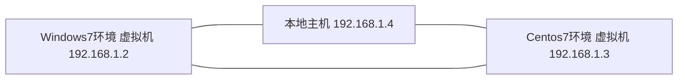

现在搭建一个测试环境，要求有一个服务端和一个客户端。服务端是`Linux`环境，客户端是`Windows`环境。已经在虚拟机中安装了两个虚拟机，一个是`Centos 7`环境，另一个是`Windows 7`环境。需要进行网络配置，实现两台虚拟机和本地主机之间的网络访问。

## 网络规划

先规划这三个主机的`IP`地址。

## 相关配置

1. 编辑-虚拟网络编辑器中将`VMnet1`类型仅主机模式勾选将主机虚拟适配器连接到此网络。

2. `Windows7`虚拟机和`Centos7`虚拟机的`网络适配器`都设置为自定义`VMnet1(仅主机模式)`

3. 分别修改`Windows7`虚拟机和`Centos7`虚拟机的`IP`地址为`192.168.1.2`和`192.168.1.3`。

4. 本地`VMware Network Adapter VMnet1`网卡的`IP`配置为`192.168.1.4`。

5. 测试通信状况。

以上就实现了，多个虚拟机和本地主机的通讯。

[//]:#(设置表格整体居中显示)

